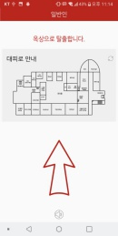
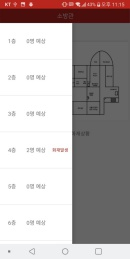

# Seoul_IoT_Hackathon 2018 - 화재알림서비스 (a.k.a 삐뽀)

## 서비스 소개
해당 서비스는 화재발생시 건물내의 비콘을 이용하여, 빠른 대피경로를 안내해줍니다. 또한 소방관, 안전관리자에게는 건물 내 인원의 위치를 파악할 수 있게 하여 효과적인 구출루트를 계획하는 것이 가능합니다. 또한 화재발생시 서비스로 실행되어있던 앱에서 사용자에게 알람을 주어, 화재가 발생했음을 보다 빠르게 알 수 있습니다.

## 포지션
- 개발자3(프론트엔드-안드로이드앱, 백엔드, 임베디드)

- 디자이너2(UI)

## 세부 서비스 안내
#### 인트로
> - 화재알림서비스-삐뽀 앱 어플리케이션 실행시 4초간 인트로 로드
> > 

#### 사용자 권한요청
> - 앱 초기 실행시, 권한요청(전화번호, 위치)
> - '위치' 권한을 이용하여 사용자의 위치 파악
> - '전화번호' 권한을 이용하여 일반사용자/소방관(안전관리자) 구분
> > 
> > 
> > 

#### 메인 화면
> - '네이버 지도' api 사용
> - 서비스가 실행가능한(가등록된) 건물들을 지도에서 검색 혹은 선택
> - 해당 건물에 대한 대피 안내를 시작
> - 화재 발생시, 서비스를 이용하여 항상 실행되있던 앱이 대피 안내를 자동으로 시작할 수도 있음
> > 
> > 
> > 

#### 일반 사용자 화면(화재 발생시)
> - 건물 각 층마다 설치된 비콘을 통해 사용자의 비콘-스마트폰간의 감도를 측정
> - 비콘 정보를 기반으로 가장 가까운 대피로를 안내하며, 화살표를 통해 방향또한 안내함
> > 

#### 소방관 및 관리자 화면(화재 발생시)
> - 건물의 화재상황을 안내받게 됨
> - DrawerLayout을 이용하여 각 층을 선택할 수 있음
> - 각 층마다 위치한 일반 사용자의 수를 count함
> > 
> > 
> > 

#### 설치된 어플리케이션 아이콘 이미지
> > 
